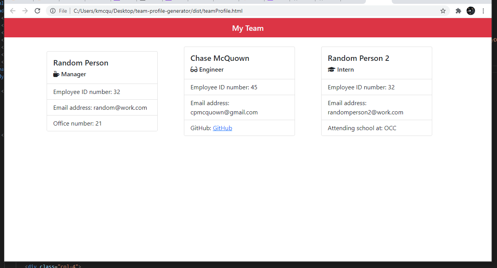

# Team-Profile-Generator

## Description

This app allows users to create a team profile via node.

## Installation

In order to use this application, the user must first clone this repo. Then, they must run "npm install" from the command line. Finally, they can begin answering the command line prompts.

## Usage

The user must simply answer the command line prompts. Once finished with the prompts, they can find their team profile in the form of an HTML file within the "dist" folder.

[Watch this video for a walkthrough of the application](https://youtu.be/4Hsb7k4P_zM)

## Contributing

Made with ❤️ by [Chase McQuown]

## Tests

In order to run the tests included in this repo, the user must install jest by running "npm install jest --save-dev" in the command line.
